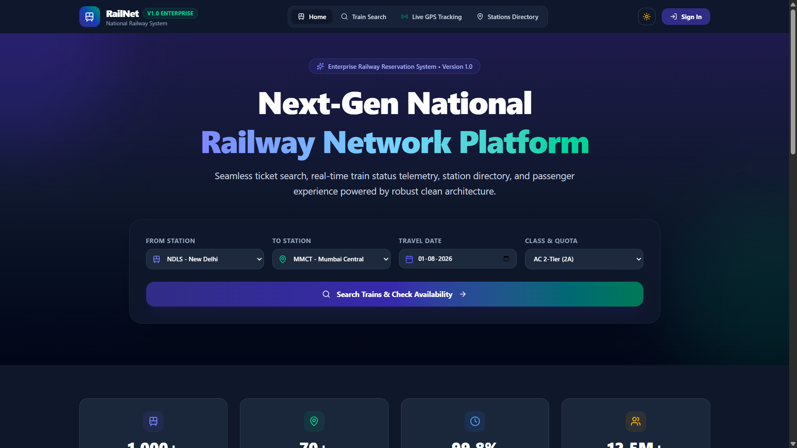
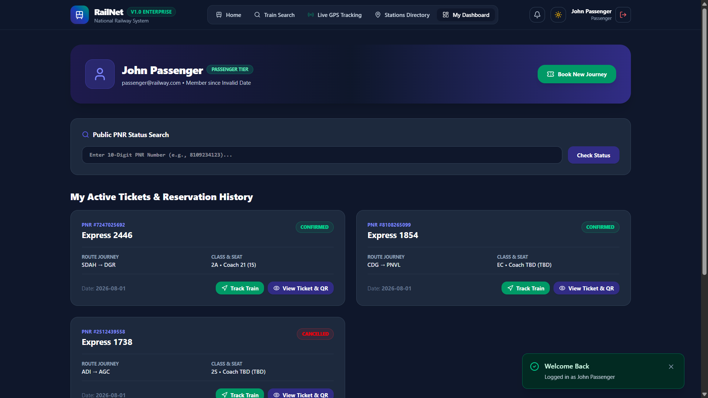

<div align="center">
  <h1>🚄 RailNet Enterprise</h1>
  <p><strong>National Railway System Platform & Admin Analytics</strong></p>

  <p>
    <a href="#features">Features</a> •
    <a href="#installation">Installation</a> •
    <a href="#deployment">Deployment</a>
  </p>

  
  
  
  
  
  
</div>

---

## 📖 Overview

RailNet Enterprise is a modern, full-stack application designed to handle complex railway reservations, live tracking, station directory indexing, and robust administrative business analytics. Built with performance and scalability in mind, it leverages a React frontend with a Node/Express backend powered by a PostgreSQL database.

## ✨ Key Features

- **🎫 Ticket Reservation:** Seamless booking flow with real-time seat availability.
- **📍 Live Tracking:** Real-time train tracking using interactive maps (Leaflet).
- **🏢 Station Directory:** Comprehensive indexing of stations and routes.
- **📊 Admin Analytics:** Rich dashboards for business intelligence and operations management.
- **🔒 Secure Authentication:** JWT-based secure user authentication and authorization.

## 📸 Screenshots

*(Add screenshots to the `docs/screenshots/` folder to display them here)*
<!-- 


-->

## 🏗️ Architecture

- **Frontend:** React 19, TypeScript, Vite, Tailwind CSS, Lucide Icons, Recharts, Leaflet.
- **Backend:** Node.js, Express, TypeScript, tsx, esbuild.
- **Database:** PostgreSQL (Neon Serverless).
- **Authentication:** JWT, bcryptjs.

## 🚀 Installation

### Prerequisites
- Node.js (v18+ recommended)
- PostgreSQL (or Neon DB connection string)

### 1. Clone the Repository
```bash
git clone https://github.com/Sanjaycs096/RAILWAY-RESERVATION.git
cd RAILWAY-RESERVATION-SYSTEM
```

### 2. Install Dependencies
```bash
npm install
```

### 3. Environment Variables
Create a `.env` file in the root directory based on `.env.example`:
```bash
cp .env.example .env
```
Ensure you configure the following variables:
- `DATABASE_URL`: Connection string for PostgreSQL.
- `JWT_SECRET`: Secret key for JSON Web Tokens.

### 4. Database Setup
Ensure your PostgreSQL database is running. If you are using a cloud provider like Neon, just supply the connection string. Run the DB seed scripts located in the `db/` directory if necessary.

### 5. Start the Application
```bash
# Starts both frontend (Vite) and backend (tsx server)
npm run dev
```

## 🌍 Deployment

This repository is configured for immediate deployment to **Vercel**.

1. Create a Vercel project and link it to this GitHub repository.
2. Configure Environment Variables in Vercel (`DATABASE_URL`, `JWT_SECRET`).
3. The build configuration (`vercel.json`) will automatically build the Vite React frontend and run the Express API as Serverless Functions (`/api/*`).

## 🧪 Testing

```bash
# Run linting/type-checking
npm run lint
```

## 🛡️ Security

- Passwords are encrypted using `bcryptjs`.
- Secure routing and session management via JWT.
- Ensure `.env` is never committed (managed via `.gitignore`).

## 📄 License

This project is licensed under the MIT License.
